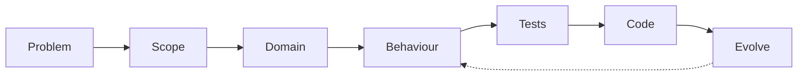

# Spec-First

A minimal starter for spec-first development.

**Website**: [spec-first.com](https://spec-first.com) — cheat sheets, tutorials, and more.

## Why Spec-First?

Most projects start with code and figure out requirements later. This leads to:
- Building the wrong thing
- Scope creep
- Tests that don't match actual requirements
- Difficulty explaining what the system does

**Spec-first flips this.** You write down what you're building *before* you build it. Benefits:

- **Clarity** — Forces you to think through requirements upfront
- **Alignment** — Spec becomes the source of truth for the team
- **Testability** — Behaviour examples translate directly to tests
- **Simplicity** — You only build what's specified, nothing more

## Who This Is For

- **Solo devs and small teams** who want lightweight structure without heavy process
- **People working with AI assistants** who need clear context to hand off to LLMs
- **Anyone starting a new project** or refactoring an existing one into something maintainable

## When to Use Spec-First

- You're building something with multiple features or user-facing behaviour
- You want tests that actually reflect what the system should do
- You're collaborating with others (including AI) and need a shared source of truth
- You've been burned by "just start coding" and want more discipline
- You're refactoring legacy code and need to document what it *should* do

## When Not to Use It

- **Throwaway scripts** — If it's under 100 lines and you'll delete it next week, just write it
- **Pure exploration** — When you're spiking or prototyping to learn, specs slow you down
- **Design-only work** — If there's no code to write, you don't need this structure
- **Heavily regulated environments** — You may need more formal documentation than this provides

## Quick Start

```bash
# Install dependencies
npm install

# Run tests
npm test

# Run tests in watch mode
npm run test:watch
```

**New to Spec-First?** Read [GETTING_STARTED.md](./GETTING_STARTED.md) for a step-by-step guide.

## The Workflow



1. **Problem** — What pain are we solving? (`spec/01-problem.md`)
2. **Scope** — What will and won't we build? (`spec/02-scope.md`)
3. **Domain** — What are the key concepts? (`spec/03-domain.md`)
4. **Behaviour** — How should it behave? (`spec/behaviour/*.feature`)
5. **Tests** — Mirror the behaviour examples (`tests/behaviour/`)
6. **Code** — Implement the simplest solution (`src/features/`)
7. **Evolve** — Document changes (`spec/evolution/`)

## Project Structure

```
spec/                    # The specification
  00-intro.md           # How to use this spec
  01-problem.md         # The problem we're solving
  02-scope.md           # What's in/out of scope
  03-domain.md          # Core concepts and terms
  04-behaviour-guide.md # How to write behaviour specs
  behaviour/            # Gherkin-style feature files
  contracts/            # API and event contracts (optional)
  verification/         # Test coverage matrix (optional)
  evolution/            # Change history

src/features/           # Implementation, organized by feature

tests/
  behaviour/            # Behaviour tests (primary)
  unit/                 # Unit tests (for complex internals)
```

## Gherkin & `.feature` Files

Behaviour specs use [Gherkin](https://cucumber.io/docs/gherkin/) syntax — a simple, readable format for describing how software should behave:

```gherkin
Feature: Shopping cart
  Scenario: Add item to empty cart
    Given an empty cart
    When I add "Socks" to the cart
    Then the cart should contain 1 item
```

The `Given`/`When`/`Then` structure maps directly to test setup, action, and assertion.

### IDE Setup

For syntax highlighting and autocomplete in `.feature` files:

| IDE | Extension |
|-----|-----------|
| **VS Code** | [Cucumber (Gherkin) Full Support](https://marketplace.visualstudio.com/items?itemName=alexkrechik.cucumberautocomplete) |
| **JetBrains** (WebStorm, IntelliJ) | Built-in — enable "Gherkin" plugin in settings |
| **Vim/Neovim** | `vim-cucumber` or treesitter `gherkin` parser |
| **Sublime Text** | "Gherkin (Cucumber) Syntax" package |

For VS Code, install from the command line:

```bash
code --install-extension alexkrechik.cucumberautocomplete
```

See `cheat-sheets/behaviour-gherkin.md` for full Gherkin syntax reference.

## Using Spec-First with AI Assistants

Spec-first works well with AI coding assistants. The structured specs give the AI clear context about what you're building.

**Filling in spec files:**
> "Read `spec/01-problem.md` and help me fill in the Problem Statement and Goals sections for a task management app."

**Writing Gherkin from requirements:**
> "Based on `spec/02-scope.md`, write a `.feature` file for the 'create task' behaviour. Include scenarios for success, validation errors, and duplicate names."

**Generating tests from behaviour specs:**
> "Read `spec/behaviour/tasks.feature` and create a matching test file at `tests/behaviour/tasks.behaviour.test.ts`. Mirror each scenario as a test case."

**Implementing from specs:**
> "Read the spec files in `spec/` and the tests in `tests/behaviour/tasks.behaviour.test.ts`. Implement the code to make the tests pass."

The key is pointing the AI at your spec files so it understands the requirements before writing code.

**More prompts:** See [AI_HELP.md](./AI_HELP.md) for a full list of copy-paste prompts.

## Adapting Spec-First to Your Project

### New project

1. Use this template to create your repo
2. Update `package.json` with your project name
3. Fill out `spec/01-problem.md`, `spec/02-scope.md`, `spec/03-domain.md`
4. Delete the Counter demo files (see below)
5. Write your first `.feature` file and matching tests

### Existing project

1. Copy the `spec/` folder into your project
2. Document current behaviour first—write specs for what already exists
3. Add behaviour tests that mirror those specs
4. Evolve incrementally—new features get specs before code

## Demo Feature

This template includes a **Counter** demo to show the workflow in action:

| Step | File |
|------|------|
| Behaviour spec | `spec/behaviour/counter.feature` |
| Behaviour tests | `tests/behaviour/counter.behaviour.test.ts` |
| Unit tests | `tests/unit/counter.test.ts` |
| Implementation | `src/features/counter/counter.ts` |

Open these files side by side to see how specs connect to tests and code.

### Cleaning up the demo

Once you're comfortable with the workflow, delete the demo files:

```bash
# Remove demo code and tests
rm -rf src/features/counter
rm tests/behaviour/counter.behaviour.test.ts
rm tests/unit/counter.test.ts
rm spec/behaviour/counter.feature
```

Also remove the "Counter Demo" sections from the spec templates:
- `spec/01-problem.md`
- `spec/02-scope.md`
- `spec/03-domain.md`
- `spec/evolution/behaviour-changelog.md`

## Quick Reference

Visit [spec-first.com](https://spec-first.com) for online cheat sheets and tutorials.

The `cheat-sheets/` folder also has offline quick reference guides:

| Guide | What it covers |
|-------|----------------|
| [overview.md](./cheat-sheets/overview.md) | Spec-first workflow at a glance |
| [problem-scope-domain.md](./cheat-sheets/problem-scope-domain.md) | Templates for early spec docs |
| [behaviour-gherkin.md](./cheat-sheets/behaviour-gherkin.md) | Gherkin syntax and examples |
| [contracts-tests.md](./cheat-sheets/contracts-tests.md) | API contracts and test organization |
| [evolution.md](./cheat-sheets/evolution.md) | Managing spec changes over time |

## Philosophy

- **Small** — Keep specs concise and practical
- **Clear** — Use plain language, not jargon
- **Traceable** — Tests map directly to spec examples
- **Minimal** — Only build what's specified

## Roadmap

These are aspirational ideas, not yet implemented:

- **Design layer** — Add support for linking specs to UI mockups or wireframes
- **Build verification** — Tooling to auto-check that tests cover all spec scenarios
- **Richer AI integration** — Pre-built prompts or CLI commands for common spec tasks

## License

MIT
